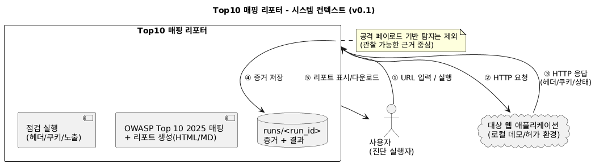
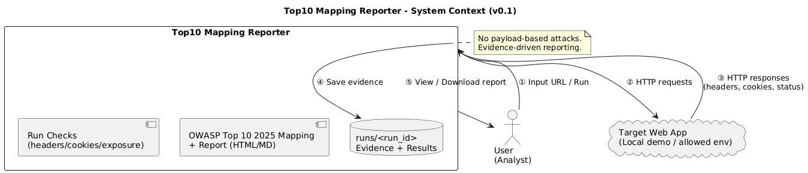

# Requirements v0.1  
Top10 Mapping Reporter

---

## 0-1) 프로젝트 한 줄 정의

- 입력: 대상 URL  
- 처리: 관찰 가능하고 재현 가능한 체크리스트 수행  
- 출력: OWASP Top 10 2025 카테고리별 리포트(HTML / Markdown) + 증거 파일

---

## 0-2) 사용자(Actor)

- 사용자: 진단 실행자  
  (개발자 또는 보안 학습자)

---

## 0-3) MVP 기능 요구사항 (Functional Requirements)

- FR-01. 사용자는 대상 URL을 입력할 수 있어야 한다.
- FR-02. 시스템은 HTTP 요청을 통해 응답(헤더, 쿠키, 상태 코드)을 수집해야 한다.
- FR-03. 시스템은 사전에 정의된 체크리스트를 기반으로 점검을 수행해야 한다.
- FR-04. 시스템은 점검 결과를 OWASP Top 10 2025 카테고리에 매핑해야 한다.
- FR-05. 시스템은 점검 근거(Evidence)를 파일 형태로 저장해야 한다.
- FR-06. 시스템은 점검 결과를 HTML 또는 Markdown 형식의 리포트로 제공해야 한다.

---

## 0-3-1) 시스템 컨텍스트 다이어그램 (System Context Diagram)

아래 다이어그램은  
Top10 Mapping Reporter 시스템의 전체 흐름과  
외부 구성요소 간의 관계를 한 눈에 이해하기 위한 컨텍스트 다이어그램이다.

사용자(진단 실행자), 점검 대상 웹 애플리케이션,  
그리고 리포터 시스템 간의 기본적인 상호작용을 표현한다.

### 시스템 컨텍스트 다이어그램 (Korean)

### System Context Diagram (English)

---

## 0-4) 비기능 요구사항 (Non-Functional Requirements)

- NFR-01. 본 도구는 외부 실서비스에 대한 무단 점검을 수행하지 않는다.  
  (로컬 데모 환경 또는 사전 허가된 테스트 환경을 기본 대상으로 한다.)
- NFR-02. 모든 점검 결과는 취약점 “확정” 표현을 사용하지 않는다.
- NFR-03. 점검 결과는 동일 조건에서 재현 가능해야 한다.
- NFR-04. 증거(Evidence) 저장 시 민감 정보는 마스킹 처리해야 한다.
- NFR-05. 점검이 불가능한 상황은 명확한 결과 상태 값으로 표현해야 한다.

---

## 0-4-1) 점검 결과 상태 정의

점검 결과는 다음 다섯 가지 상태 중 하나로 표현한다.

| 상태 | 의미 |
|---|---|
| 확인됨 (PASS) | 보안 설정이 정상적으로 확인된 상태 |
| 설정 미흡 (WEAK) | 설정은 존재하나 보안 관점에서 충분하지 않은 상태 |
| 미설정 (MISSING) | 관련 보안 설정이 확인되지 않은 상태 |
| 식별됨 (OBSERVED) | 보안상 의미를 가질 수 있는 요소가 식별되어 주의가 필요한 상태 |
| 확인불가 (NOT_TESTED) | 환경적·기술적 이유로 판단에 필요한 근거를 확보하지 못한 상태 |

### 상태 정의 원칙

- PASS / WEAK / MISSING는 **설정에 대한 판정 결과**이다.
- OBSERVED(식별됨)는 **주의가 필요한 요소를 식별했음을 의미**하며,  
  위험 여부를 확정하지 않는다.
- NOT_TESTED(확인불가)는 도구의 한계 또는 입력 부족을 솔직히 드러내기 위한 상태이다.

---

## 0-5) 범위 정의 (Scope)

### In-Scope (MVP)

- HTTP 보안 헤더 설정 점검
- Cookie 속성(Secure, HttpOnly, SameSite) 확인
- 서버 정보 및 배너 노출 여부 확인
- robots.txt / sitemap.xml 존재 여부 확인

### Out-of-Scope (Non-Goals)

- SQL Injection, XSS, SSRF 등 공격 페이로드 기반 탐지
- 취약점 자동 익스플로잇
- 외부 실서비스에 대한 공격성 스캔